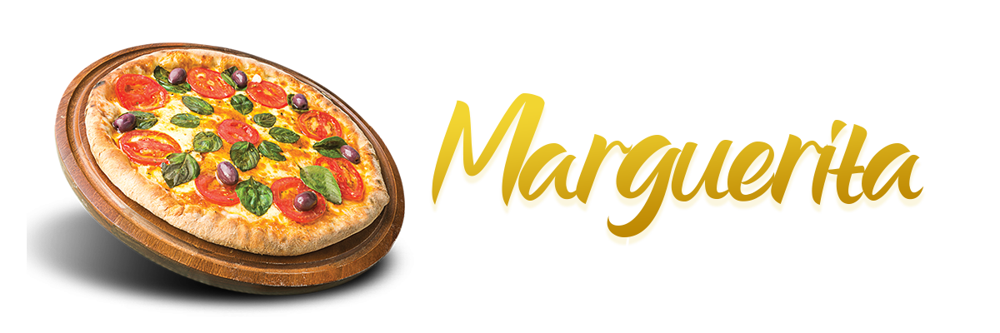
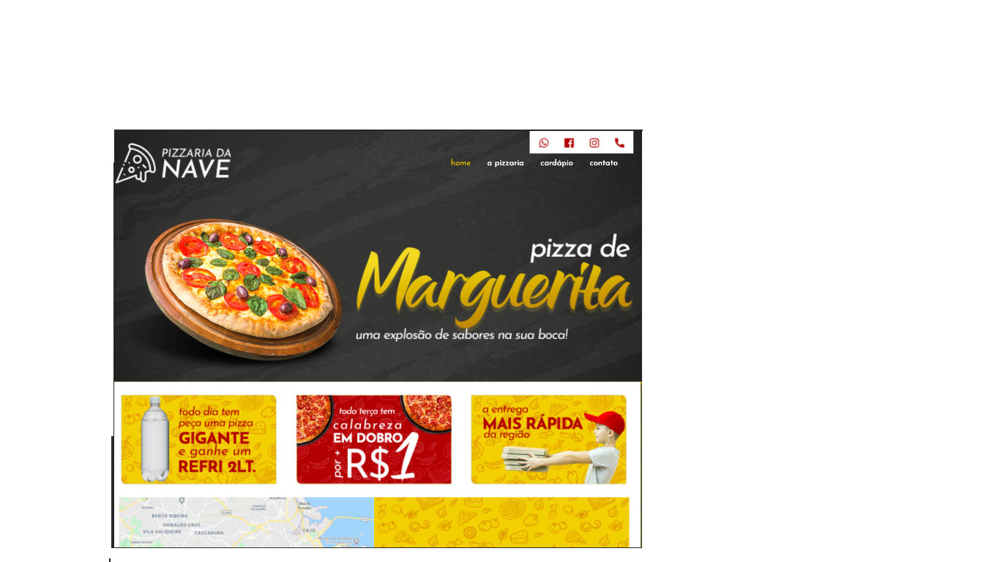
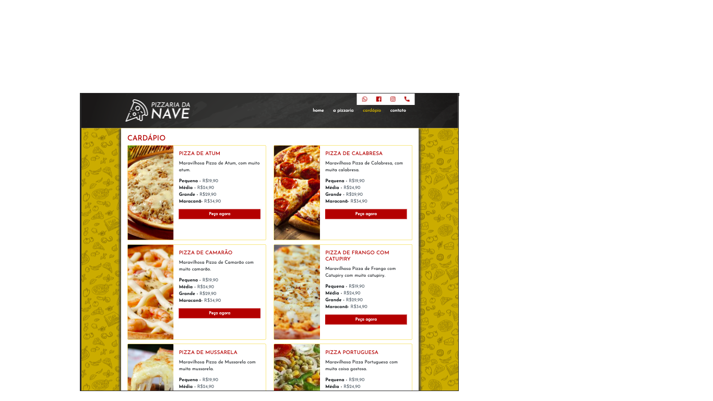

<h1 align="center" > 🍕Pizzaria da Nave</h1>

Pizzeria da Nave website

<h4 align="center">
🍕Pizzria da Nave 🍕Concluded📌
</h4>

 

 <a href="#sobre">About the project</a> •
 <a href="#aplicacao"> Application Demo</a> • 
 <a href="#requesitos"> Prerequisites</a> • 
 <a href="#tecnologias">Technology</a> • 
 <a href="#creditos">Credits</a>• 
 <a href="#versoes">README versions</a> • 

<h2 id="sobre"> About the project </h2>

Conclusion project of the HTML / CSS course at <a href="https://navedoconhecimento.rio/"> Nave do Conhecimento </a>. With the objective of creating a Website.

<h2 id="aplicacao">🖇️ Application Demo</h2>

• To view and interact with the Site, access <a href="https://pizzaria-nave.vercel.app/Index.html">Pizzaria da Nave </a>

<h2  id="requesitos">💻 Prerequisites</h2>

Before you start, you'll need to install a text editor on your machine,
Visual Studio Code is recommended.

<h2 id="tecnologias">  🛠 Technology</h2>

	The following tools were used in the construction of the project: 
∙	<a href="#">Html</a>  
∙	<a href="#">CSS</a>  
∙	<a href="https://getbootstrap.com/">Bootstrap</a>  

<h2 id="creditos">✨ Credits</h2>

Course: HTML/CSS at <a href="https://navedoconhecimento.rio/"> Nave do Conhecimento </a> 

Teacher: <a href="https://github.com/vitordesousa">Vitor de Sousa </a> 
 

  
 <b>Izabella Loyse Cândido</b>  
 Developed with love by Izabella Loyse Cândido💙
 Get in touch 📝 I await you!
  

 

<h2 id="versoes">README versions</h2>

<a href="https://github.com/IzabellaLoyse/Pizzaria-Nave/blob/master/README.md">Português 🇧🇷</a> | 
<a href="https://github.com/IzabellaLoyse/Pizzaria-Nave/blob/master/README-en.md">English 🇺🇸</a>

